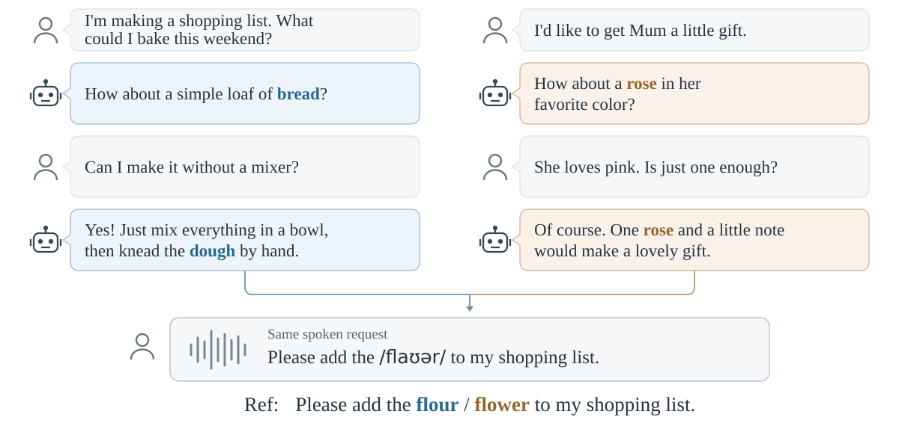

[English](README.md) | [中文](README_zh.md)

# HearInContext

### A Benchmark for Implicit Context in Speech Recognition

[](https://github.com/OPPO-Mente-Lab/HearInContext)
[](https://huggingface.co/datasets/OPPOer/HearInContext)
[](LICENSE)



*示意：不同助手历史使同一句语音分别对应 flour 或 flower。对话与波形均为示意。*

[评测协议](docs/evaluation.md) · [训练与解码](qwen/README.md)

HearInContext 评测语音识别模型如何利用对话中的隐式语义线索，在固定音频的条件下区分上下文消歧与显式词语提示。

- 支持普通话和英语，覆盖无上下文、隐式、无关与显式上下文条件。
- 统一计算 CER/WER 和目标词召回率，支持按条件及说话人汇总。
- 提供 Qwen3-ASR 微调、解码入口与配对 bootstrap 工具。
- 评分仅需 CPU，模型训练与解码使用 GPU。

## 安装

在仓库根目录执行，使用 Python 3.12：

```bash
conda create -n hearincontext python=3.12 -y
conda activate hearincontext
python -m pip install -r requirements.txt
```

训练与解码环境见 [Qwen 使用说明](qwen/README.md)。

## 数据集

训练集、测试集及完整数据卡在 [Hugging Face](https://huggingface.co/datasets/OPPOer/HearInContext) 单独提供。数据构建、音频合成、参考音色和数据许可统一见数据卡。

## 快速评测

准备测试清单 `test.jsonl` 和模型转写 `predictions.jsonl`。每条转写使用对应样例的完整 `example_id`：

```json
{"example_id":"demo::C1::voice1","hypothesis":"Please check the flour."}
```

执行评分：

```bash
python evaluation/evaluate.py \
  --manifest test.jsonl \
  --hypotheses predictions.jsonl \
  --output outputs/metrics.json
```

两份文件的 ID 必须唯一且完全对应；空转写正常计分。输出路径须为新路径。

结果按语言和条件汇总。`error_rate` 和 `target_recall` 为比例值，乘以100即为百分比。添加 `--observations outputs/rows.jsonl` 可保存逐条统计。

## 训练与解码

从官方 Qwen3-ASR 基座开始训练，再使用所选 checkpoint 解码：

- [训练配置与命令](qwen/README.md#full-parameter-training)
- [解码命令](qwen/README.md#decode-a-local-checkpoint-or-official-base-model)

本项目提供代码和数据，不分发微调权重。

## 更多用法

- [输入格式、规范化与配对置信区间](docs/evaluation.md)
- [多实体评分与 AISHELL-1-NE](docs/entities.md)

运行测试：

```bash
python -m unittest discover -s tests
```

## 引用

```bibtex
@misc{gao2026hearincontext,
  title  = {HearInContext: A Benchmark for Implicit Context in Speech Recognition},
  author = {Gao, Yifan and Tian, Yao and Suo, Hongbin and Lu, Haonan},
  year   = {2026}
}
```

## 致谢

- [Qwen3-ASR](https://github.com/QwenLM/Qwen3-ASR)：模型、训练与推理实现。
- [Whisper](https://github.com/openai/whisper) / [Transformers](https://github.com/huggingface/transformers)：英文规范化实现。

## 许可

本项目代码采用 [Apache-2.0](LICENSE)。第三方代码保留原始版权与许可，详见 [NOTICE](NOTICE)。
